# 唤醒兽平台 (HXS) - 项目架构思维导图

> 最后更新：2025年12月9日

---

## 一、应用总体结构

```
                          ┌─────────────────────┐
                          │    唤醒兽平台 (HXS)    │
                          │  移动端生活服务平台    │
                          └──────────┬──────────┘
                                     │
        ┌─────────────────────────────┼─────────────────────────────┐
        │                             │                             │
┌───────┴───────┐     ┌────────┴────────┐     ┌───────┴───────┐
│   核心层 (7模块)   │     │    技术栈          │     │   底部导航 (5项)  │
├────────────────┤     ├─────────────────┤     ├───────────────┤
│ • Core(核心)      │     │ • Vue 3.5.17     │     │ • 首页          │
│ • Camp(唤醒营)     │     │ • Vite 7.0.4     │     │ • 大狮兄(AI)    │
│ • Account(账户)   │     │ • Vue Router 4   │     │ • 能量树        │
│ • Commerce(商业)  │     │ • TailwindCSS 4  │     │ • 消息          │
│ • Social(社交)     │     │ • 高德地图 API    │     │ • 我的          │
│ • Org(组织)       │     └─────────────────┘     └───────────────┘
│ • Help(帮助)      │
└────────────────┘
```

---

## 二、路由模块架构

```
唤醒兽路由系统 (113 页面)
│
├── Core 核心导航 (12页)
│   ├── / 首页 (双模式切换)
│   ├── /ai-assistant AI管家·大狮兄
│   ├── /energy-tree 能量树
│   ├── /daily-tasks 每日任务
│   ├── /energy-items 能量道具
│   ├── /call 打Call
│   ├── /group-play 组团去玩
│   ├── /activity-detail/:id 活动详情
│   ├── /activity-signup/:id 活动报名
│   ├── /activity-payment/:id 待付款
│   ├── /activity-pending/:id 待出行
│   └── /map-demo 高德地图演示
│
├── Camp 唤醒营 (4页)
│   ├── /camp 唤醒营首页
│   ├── /camp-detail/:id 免费体验详情
│   ├── /camp-register 唤醒营注册
│   └── /weight-management-camp 体重管理营
│
├── Account 账户中心 (35页)
│   ├── 登录认证
│   │   ├── /signin 登录
│   │   ├── /daily-signin 每日签到
│   │   └── /checkin 健康打卡
│   ├── 个人中心
│   │   ├── /me 我的
│   │   ├── /profile 个人资料
│   │   └── /settings 设置
│   ├── 钱包资产
│   │   ├── /wallet 我的钱包
│   │   ├── /asset-detail 总资产
│   │   ├── /wallet-detail 零钱
│   │   ├── /energy-coin 能量币
│   │   ├── /gift-reward 礼物打赏
│   │   ├── /service-income 服务收入
│   │   └── /star-promoter-income 星推官收入
│   ├── 唤醒师注册
│   │   ├── /register-waker 注册入口
│   │   ├── /register-waker/authenticate 主理人认证
│   │   ├── /register-waker/license-input 执照输入
│   │   ├── /register-waker/submit-success 提交成功
│   │   ├── /register-waker/application-status 审核进度
│   │   ├── /register-waker/skill 技能唤醒师
│   │   └── /register-waker/partner 搭子唤醒师
│   └── 设置与隐私
│       ├── /account-security 账号安全
│       ├── /privacy 隐私管理
│       ├── /privacy-policy 隐私政策
│       └── /user-agreement 用户协议
│
├── Commerce 商业服务 (39页)
│   ├── 商品与订单
│   │   ├── /store 我的橱窗
│   │   ├── /services 推荐服务
│   │   ├── /product-detail/:id 商品详情
│   │   ├── /my-orders 我的订单
│   │   └── /favorites 我的收藏
│   ├── 搜索与发现
│   │   ├── /search 搜索
│   │   └── /search-results 搜索结果
│   ├── 商家后台 (19子页)
│   │   ├── /business-admin 后台首页
│   │   ├── /business-admin/profile-edit 主页装修
│   │   ├── /business-admin/data-center 数据中心
│   │   ├── /business-admin/reviews 评价管理
│   │   ├── /business-admin/service-management 服务管理
│   │   ├── /business-admin/star-promotion 星推官带货
│   │   ├── /business-admin/casual-promotion 随心推
│   │   ├── /business-admin/free-trial 免费体验
│   │   ├── /business-admin/sub-accounts 子账户
│   │   ├── /business-admin/popularity-ranking 人气榜单
│   │   └── 商品创建 (7类型)
│   │       ├── voucher-create 代金券
│   │       ├── times-card-create 次卡
│   │       ├── discount-payment-create 优惠买单
│   │       ├── free-trial-create 免费体验
│   │       ├── period-card-create 周期卡
│   │       ├── presale-voucher-create 预售券
│   │       └── group-buying-package-create 团购套餐
│   └── 财务与订单
│       ├── /verification 验券及退款
│       ├── /financial-reconciliation 财务对账
│       ├── /group-buying-orders 团购订单
│       └── /energy-theater 能量剧场
│
├── Social 社交互动 (12页)
│   ├── /messages 消息中心
│   ├── /chat 聊天
│   ├── /partners 生活搭子
│   ├── /ranking 城市大神榜单
│   ├── /daily 日常
│   ├── /publish-activity 发布动态
│   ├── /dynamic-detail/:id 动态详情
│   ├── /follow 新增关注
│   ├── /comments 评论和@
│   ├── /add-friends 添加好友
│   ├── /friend-ranking 好友排行
│   └── /create-activity 创建活动
│
├── Org 组织与唤醒师 (8页)
│   ├── /teacher-list 唤醒狮列表
│   ├── /ouyang 教练详情
│   ├── /leader-channel 主理人频道
│   ├── /buddy-waker 搭子唤醒师
│   ├── /waker-alliance 唤醒联盟
│   ├── /team 醒狮团队
│   ├── /organization-verification 机构认证
│   └── /register-waker/map-claim 地图认领
│
└── Help 帮助信息 (3页)
    ├── /help 帮助中心
    ├── /feedback 意见反馈
    └── /about 关于我们
```

---

## 三、底部导航结构图

```
┌─────────────────────────────────────────────────────────────────────┐
│                         底部导航栏 (FooterNav)                          │
├─────────────┬─────────────┬─────────────┬─────────────┬─────────────┤
│    首页     │   大狮兄    │    能量     │    消息     │    我的     │
│     /      │/ai-assistant│ /energy-tree│  /messages  │    /me     │
│   🐾       │   🤖        │    🌳       │   💬        │   👤       │
├─────────────┼─────────────┼─────────────┼─────────────┼─────────────┤
│ 双向切换:   │            │            │            │            │
│ / ↔       │ AI智能匹配  │ 能量树成长  │ 消息中心   │ 个人中心   │
│/teacher-  │ 对话历史   │ 每日任务   │ 系统通知   │ 钱包财务   │
│ list      │ 教练推荐   │ 能量道具   │ 聊天记录   │ 设置功能   │
└─────────────┴─────────────┴─────────────┴─────────────┴─────────────┘
```

---

## 四、首页跳转关系图

```
                              ┌────────────────┐
                              │    首页 (/)     │
                              │  IndexPage.vue  │
                              └────────┬───────┘
                                       │
    ┌─────────────┬─────────────┬─────┼─────┬─────────────┬─────────────┐
    │             │             │           │             │             │
    ▼             ▼             ▼           ▼             ▼             ▼
┌─────────┐ ┌─────────┐ ┌─────────┐ ┌─────────┐ ┌─────────┐ ┌─────────┐
│  搜索   │ │ AI助手  │ │  地图   │ │  教练   │ │  榜单   │ │  活动   │
│ /search │ │ /ai-   │ │/map-demo│ │/teacher-│ │/ranking │ │/group-  │
│         │ │assistant│ │         │ │ list    │ │         │ │  play   │
└─────────┘ └─────────┘ └─────────┘ └─────────┘ └─────────┘ └─────────┘
    │                                   │             │
    │                                   │             │
    ▼                                   ▼             ▼
┌───────────┐                       ┌─────────┐ ┌───────────┐
│/search-    │                       │  /ouyang │ │ /activity- │
│ results    │                       │ 教练详情 │ │  detail    │
└───────────┘                       └─────────┘ └───────────┘

首页快捷入口:
├── 生活主理人  → /teacher-list?tab=主理人
├── 技能唤醒师  → /teacher-list?tab=生活技能
├── 同城好搭子  → /teacher-list?tab=生活搭子
├── 城市大师    → /ranking
├── 免费体验    → /camp-register
└── 体重管理营  → /weight-management-camp
```

---

## 五、我的页面跳转图

```
                         ┌────────────────────┐
                         │     我的 (/me)      │
                         │    MePage.vue      │
                         └──────────┬─────────┘
                                    │
    ┌──────────┬──────────┬────────┼────────┬──────────┬──────────┐
    │          │          │        │        │          │          │
    ▼          ▼          ▼        ▼        ▼          ▼          ▼
┌────────┐┌────────┐┌───────┐┌──────┐┌────────┐┌────────┐┌────────┐
│ 订单   ││ 收藏   ││ 评价  ││ 钱包 ││注册唤  ││商家后台││ 设置   │
│/my-   ││/favor- ││/my-   ││/wallet││ 醒师   ││/business││/settings│
│orders ││ ites   ││reviews││      ││/register││ -admin  ││        │
└────────┘└────────┘└───────┘└──┬───┘└───┬────┘└───┬────┘└────────┘
                          │        │          │
                          ▼        ▼          ▼
                   ┌────────┐┌────────┐┌───────────────┐
                   │钱包子页 ││注册流程││  商家后台子页   │
                   ├────────┤├────────┤├───────────────┤
                   │总资产   ││主理人  ││ 验券及退款     │
                   │零钱     ││技能师  ││ 交易查询       │
                   │能量币   ││搭子师  ││ 商品管理       │
                   │礼物打赏 │└────────┘│ 评价管理       │
                   │服务收入 │        │ 财务对账       │
                   └────────┘        │ 数据中心       │
                                     │ ...           │
                                     └───────────────┘

其他入口:
├── 添加好友 → /add-friends
├── 唤醒联盟 → /waker-alliance
├── 醒狮团队 → /team
└── 发布动态 → /publish-activity
```

---

## 六、唤醒师注册流程图

```
┌─────────────────────────────────────────────────────────────────┐
│                       唤醒师注册流程                            │
└────────────────────────────────┬────────────────────────────────┘
                                 │
                                 ▼
                    ┌─────────────────────┐
                    │    注册唤醒师入口    │
                    │  /register-waker   │
                    └──────────┬──────────┘
                               │
          ┌───────────────────┼───────────────────┐
          │                   │                   │
          ▼                   ▼                   ▼
┌─────────────────┐ ┌─────────────────┐ ┌─────────────────┐
│   主理人认证     │ │   技能唤醒师     │ │   搭子唤醒师     │
│ /authenticate  │ │    /skill      │ │   /partner     │
└────────┬────────┘ └─────────────────┘ └─────────────────┘
         │
         ├─────────────────┐
         │                 │
         ▼                 ▼
┌─────────────────┐ ┌─────────────────┐
│   执照信息认证   │ │    地图认领     │
│ /license-input │ │  /map-claim    │
└────────┬────────┘ └─────────────────┘
         │
         ▼
┌─────────────────┐
│    提交成功     │
│ /submit-success│
└────────┬────────┘
         │
         ▼
┌─────────────────────┐
│      审核进度       │
│ /application-status │
└─────────────────────┘
```

---

## 七、商家后台功能图

```
┌─────────────────────────────────────────────────────────────────┐
│                   商家后台 (/business-admin)                    │
│                   BusinessAdminPage.vue                       │
└────────────────────────────────┬────────────────────────────────┘
                                 │
    ┌─────────────┬─────────────┼─────────────┬─────────────┐
    │             │             │             │             │
    ▼             ▼             ▼             ▼             ▼
┌───────────┐┌───────────┐┌───────────┐┌───────────┐┌───────────┐
│  验券退款  ││  交易查询  ││  商品管理  ││  主页信息  ││  评价管理  │
│/verification││/group-    ││/service-  ││/profile-  ││ /reviews   │
│           ││buying-    ││management ││  edit     ││           │
└───────────┘│orders     │└────┬──────┘└───────────┘└───────────┘
            └───────────┘     │
                              │ 商品创建 (7类型)
                              ├── 代金券创建
                              ├── 次卡创建
                              ├── 优惠买单创建
                              ├── 免费体验创建
                              ├── 周期卡创建
                              ├── 预售券创建
                              └── 团购套餐创建

第二行功能:
├── 星推官带货 (/star-promotion)
├── 随心推 (/casual-promotion)
├── 财务对账 (/financial-reconciliation)
├── 数据中心 (/data-center)
└── 免费体验 (/free-trial)

第三行功能:
├── 动态发布 (/publish-activity)
├── 人气榜单 (/popularity-ranking)
├── 子账户 (/sub-accounts)
└── 能量剧场 (/energy-theater)
```

---

## 八、项目统计

```
┌─────────────────────────────────────────────────────────────────┐
│                         项目数据统计                            │
├─────────────────────────────────────────────────────────────────┤
│                                                                 │
│  ███████████████████████████████████████  Commerce: 39页 (35%)   │
│  ███████████████████████████████████  Account: 35页 (31%)     │
│  ████████████  Core: 12页 (11%)                               │
│  ████████████  Social: 12页 (11%)                             │
│  ████████  Org: 8页 (7%)                                       │
│  ████  Camp: 4页 (4%)                                          │
│  ███  Help: 3页 (3%)                                            │
│                                                                 │
├─────────────────────────────────────────────────────────────────┤
│  总计页面: 113                                                    │
│  底部导航: 5 个主入口                                              │
│  路由模块: 7 个                                                    │
└─────────────────────────────────────────────────────────────────┘
```

---

## 九、技术栈思维导图

```
                           唤醒兽平台技术栈
                                 │
        ┌─────────────────────┼─────────────────────┐
        │                     │                     │
        ▼                     ▼                     ▼
┌───────────────┐   ┌───────────────┐   ┌───────────────┐
│   核心框架      │   │   样式方案      │   │   工具链       │
├───────────────┤   ├───────────────┤   ├───────────────┤
│ Vue 3.5.17    │   │ TailwindCSS 4  │   │ Vite 7.0.4    │
│ Composition   │   │ 原子化CSS     │   │ 快速构建       │
│ API           │   │               │   │               │
├───────────────┤   ├───────────────┤   ├───────────────┤
│ Vue Router 4  │   │ PostCSS 8     │   │ @vitejs/     │
│ 路由管理       │   │ CSS后处理      │   │ plugin-vue   │
│               │   │               │   │               │
├───────────────┤   ├───────────────┤   ├───────────────┤
│               │   │ Less 4.4.1   │   │ pnpm         │
│               │   │ CSS预处理      │   │ 包管理         │
└───────────────┘   └───────────────┘   └───────────────┘

                           外部服务
                              │
                              ▼
                   ┌─────────────────┐
                   │  高德地图 API   │
                   │  @amap/amap-  │
                   │  jsapi-loader │
                   └─────────────────┘
```

---

**版本**: v0.1.0  
**最后更新**: 2025年12月9日  
**维护人**: 开发团队

# 唤醒兽平台(HXS)项目架构思维导图

```mermaid
graph TD
    A[唤醒兽平台 HXS] --> B[技术栈]
    A --> C[项目结构]
    A --> D[核心功能模块]
    A --> E[路由架构]
    A --> F[组件架构]
    
    B --> B1[前端框架: Vue 3]
    B --> B2[路由管理: Vue Router 4]
    B --> B3[构建工具: Vite]
    B --> B4[样式框架: TailwindCSS]
    B --> B5[CSS预处理器: Less]
    B --> B6[图标库: Font Awesome]
    
    C --> C1[src目录]
    C --> C2[public目录]
    C --> C3[其他配置文件]
    
    C1 --> C11[assets资源文件]
    C1 --> C12[components公共组件]
    C1 --> C13[router路由配置]
    C1 --> C14[views页面组件]
    C1 --> C15[App.vue根组件]
    C1 --> C16[main.js入口文件]
    
    D --> D1[首页 IndexPage]
    D --> D2[AI助手 AIAssistantPage]
    D --> D3[教练列表 TeacherListPage]
    D --> D4[用户中心功能]
    D --> D5[排行榜 RankingPage]
    D --> D6[健康打卡 CheckInPage]
    D --> D7[日常页面 DailyPage]
    D --> D8[社交功能]
    D --> D9[增值服务]
    
    D1 --> D11[城市选择器]
    D1 --> D12[搜索与匹配]
    D1 --> D13[核心功能入口]
    D1 --> D14[快捷功能入口]
    D1 --> D15[双模式切换]
    
    D4 --> D41[个人资料管理]
    D4 --> D42[订单管理]
    D4 --> D43[收藏夹]
    D4 --> D44[优惠券系统]
    D4 --> D45[地址管理]
    
    D5 --> D51[人气大师]
    D5 --> D52[冠军大师]
    D5 --> D53[非遗大师]
    D5 --> D54[三模式切换]
    
    D6 --> D61[心情打卡]
    D6 --> D62[睡眠打卡]
    D6 --> D63[运动打卡]
    D6 --> D64[饮食打卡]
    D6 --> D65[代谢打卡]
    D6 --> D66[打卡日历]
    
    D8 --> D81[消息系统]
    D8 --> D82[动态分享]
    D8 --> D83[排行榜]
    
    D9 --> D91[能量树]
    D9 --> D92[每日签到]
    D9 --> D93[唤醒营]
    
    E --> E1[核心页面路由]
    E --> E2[功能页面路由]
    E --> E3[详情页面路由]
    E --> E4[路由特性]
    
    E1 --> E11["/(首页)"]
    E1 --> E12["/ai-assistant(AI助手)"]
    E1 --> E13["/teacher-list(教练列表)"]
    E1 --> E14["/energy-tree(能量树)"]
    E1 --> E15["/messages(消息中心)"]
    E1 --> E16["/me(个人中心)"]
    
    E4 --> E41[滚动位置记忆]
    E4 --> E42[嵌套跳转处理]
    E4 --> E43[路由元信息]
    
    F --> F1[导航类组件]
    F --> F2[教练/大师展示组件]
    F --> F3[内容展示组件]
    F --> F4[健康打卡组件]
    F --> F5[日常页面组件]
    
    F1 --> F11[FooterNav.vue]
    F1 --> F12[CommonHeader.vue]
    
    F2 --> F21[CoachListCard.vue]
    F2 --> F22[CoachContentCard.vue]
    F2 --> F23[ChampionMasterCard.vue]
    F2 --> F24[Mode2Card.vue]
    F2 --> F25[ContentCard.vue]
    F2 --> F26[RankingCard.vue]
    F2 --> F27[MasterCard.vue]
    F2 --> F28[CoachListItem.vue]
    F2 --> F29[hxs-item.vue]
    
    F3 --> F31[DynamicListItem.vue]
    F3 --> F32[NotesContent.vue]
    
    F4 --> F41[CheckInCalendar.vue]
    F4 --> F42[MoodCheckIn.vue]
    F4 --> F43[SleepCheckIn.vue]
    F4 --> F44[ExerciseCheckIn.vue]
    F4 --> F45[DietCheckIn.vue]
    F4 --> F46[MetabolismCheckIn.vue]
    
    F5 --> F51[DailyHome.vue]
    F5 --> F52[DailyCoach.vue]
    F5 --> F53[DailyActivity.vue]
```

